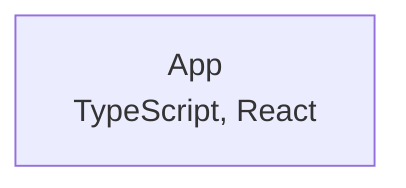

# react-template

react-template is a personal starter for React apps written in TypeScript, bundled with Webpack and Babel, and preconfigured with ESLint, Prettier, Husky, and lint-staged. Running `npx react-template <project-name>` copies the template into a new folder, sets the package name, installs dependencies with Yarn, and initializes Git with a pre-commit lint hook.

